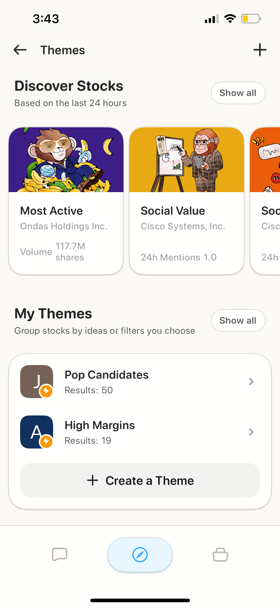

# Quick Start: iOS

Get started with Ape AI on your iPhone in 5 minutes.

***

## 📱 Step 1: Download the App

1. Open the **App Store** on your iPhone
2. Search for **"ApeAI" (one word!)**
3. Tap **Get** to download
4. Open the app once installed

> **Requirements:** iOS 18.0 or later | 308.9 MB | Age 18+

***

## 🔐 Step 2: Create Your Account

1. On the welcome screen, tap **Join the Troop** (**Sign Up)**
2. Enter your email and create a password
3. Verify your email (check your inbox)
4. Log in to the app

<figure><figcaption></figcaption></figure>

**Or sign in with:**

* Apple
* Google

<figure><figcaption></figcaption></figure>

***

## 🎭 Step 3: Choose Your Companion

**This is important! Your companion determines how the AI assists you.**

 (1).png>)

**Pick the one that matches your style:**

* **💰 Money Monty** – Balanced generalist (primary), 2–5 trades/week
* **📈 Maverick** – Momentum swing trader (days to weeks)
* **🏦 Sage** – Long‑term investor (fundamentals, buy & hold)
* **🚀 Blitz** – Experienced day trader (intraday, advanced only)

Tap your choice, then tap **Continue**.

> 💡 **Don’t worry**—you can change your companion anytime in settings.

***

## 🗺️ Step 4: Take the Tour

The app has **3 main tabs** at the bottom:

.png>)

### 1. Chat 💬

Your AI trading companion. Ask anything!

* Quick Action cards for common prompts
* Custom questions
* Trade setups and analysis

### 2. Discover 📰

Market intelligence and news

* Ticker carousel (hot stocks)
* Personalized news feed
* Trending stocks
* Themes (stock lists)

### 3. Portfolio 💼

Track and analyze your holdings

* Connect brokerages
* View positions
* Ask your companion
* Get AI analysis

***

## 🤖 Step 5: Ask Your First Question

Let's try the AI Chat:

1. Tap the **Chat** tab (bottom left)
2. You'll see **Quick Action cards**—swipe through them
3. Tap **"Major Support and Resistance"** or **"High Open Interest Options"**
4. Wait a few seconds for the AI to respond
5. Review entries, risks, and timeframe

.png>)

**Or type your own question:**

* Tap the text input at bottom
* Type: _"What stocks have improving fundamentals this month?"_
* Tap send (arrow icon)
* Get your answer!

***

## 📈 Step 6: Look Up a Stock

Let's research a stock:

1. Tap the **Search icon** (top right)
2. Type a ticker symbol (e.g., **"AAPL"**)
3. Tap the result to view the ticker page

.png>)

**You'll see:**

* Price chart (swipe timeframes)
* **AI Snapshot Grades** (A-F ratings) ⭐
* Market stats
* Bulls vs Bears sentiment
* Company Story
* Performance comparison

.png>)

**Tap any Snapshot Grade card to expand** and see the full AI analysis.

***

## 🎨 Step 7: Create Your First Theme

Themes are like custom stock screeners:

1. Go to **Discover** tab
2. Scroll down and tap **More Themes**
3. Click **"Create a theme"**
4. Type your criteria in natural language:
   * _"Tech stocks under $50 with positive earnings"_
   * _"Dividend stocks with 5%+ yield"_
   * _"EV companies with strong momentum"_
5. Name your theme
6. Save and track it!

<figure><figcaption></figcaption></figure>

***

## 💼 Step 8: Set Up Portfolio (Optional)

Want to track your investments?

1. Tap the **Portfolio** tab
2. Tap **Connect** a brokerage

**Two options:**

.png>)

### Option A: Ape Paper Trading (FREE) 📄

Perfect for beginners! Practice with virtual money.

1. See "APE AI Paper Trading" at the top
2. Tap **Claim Account**
3. Start practicing risk-free!

### Option B: Connect Real Brokerage 🏦

1. Choose your brokerage from the list
2. Follow the connection steps
3. Your positions sync automatically

***

## ⚡ Quick Tips for iOS

<figure><figcaption></figcaption></figure>

### Gestures

* **Swipe left/right** on Quick Action cards
* **Tap to expand** Snapshot Grade cards
* **Swipe back** from left edge to go back
* **Pull down to refresh** news and data

### Navigation

* **Bottom tabs** for main sections
* **Top search icon** for quick stock lookups
* **Profile icon** (top left) for settings

### Quick Actions

* Use **Quick Action cards** in Chat for common tasks
* They're faster than typing!

***

## 🎯 What's Next?

Now that you're set up:

**Complete Your Profile:**

* [Choose Your Companion](../features/companions/) (if you haven't)
* [Connect a Brokerage](../Features/Brokerage/connecting.md)

**Learn the Features:**

* [AI Chat Basics](../features/)
* [Understanding Snapshot Grades](../Features/Ticker/snapshot-grades.md)
* [What Are Themes?](../features/themes/)

**Try a Workflow:**

* [My First Stock Research](../Use-Cases/Beginner/first-research/)
* [Premarket Day Trading Routine](../Use-Cases/Advanced/premarket-routine/)

***

## ❓ Need Help?

* [Contact Support](../support.md)

***

**Welcome to the ape army! 🦍🚀**

Ready to find some alpha on the web instead? → [Web Quick Start](../Getting%20Started/quick-start-web/)
